# Stack-chan (MG90S / SG90 · Takao) — Illustrated Assembly

<p align="center">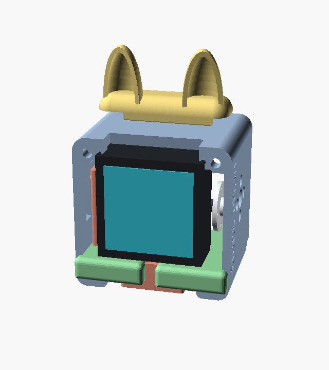</p>

A picture-by-picture build of the **"stack-chan_takao_base"** shell (the upstream
"SG90 case" set), driven by **MG90S** servos on our CoreS3 + **PCA9685** firmware.
This is the visual companion to [`ASSEMBLY.md`](ASSEMBLY.md) — read that for the
fitment notes, print tolerances, and the reasoning behind choosing this shell over
the K151/XL330 design. The images here are rendered from the **actual Takao STLs**;
the servos and the CoreS3 are simple stand-ins (we don't have STLs for them) so you
can see where each one goes.

> **Orientation used in every render:** the **display faces −Y (front)**, the
> head **pans (yaw)** about the vertical **Z** axis at the base, and **tilts
> (pitch)** about the left–right **X** axis through the head. This matches the
> firmware: yaw → **PCA9685 ch0** (±45°), pitch → **ch1** (±25°).

---

## Bill of materials

| # | Part | Qty | Notes |
|---|------|-----|-------|
| 1 | `stackchan_takao_shell_v2_resin` | 1 | Head shell — wraps the CoreS3; speaker grille + "stack-chan" emboss on one side |
| 2 | `stackchan_takao_bracket_v2.5`   | 1 | Servo bracket — holds **both** servos (pan lower, tilt upper) |
| 3 | `stackchan_takao_feet`           | 1 | Base — two pads + a centre hub with the round-horn bolt pattern |
| 4 | `stackchan_takao_hat_cat_CoreS3` | 1 | Optional cat-ear hat |
| 5 | **MG90S** metal-gear micro servo (PWM) | 2 | One pan (yaw), one tilt (pitch) — plus round horns + screws. **SG90 / MS18** (plastic-gear, ~9 g) are drop-in compatible. |
| 6 | **M5Stack CoreS3**               | 1 | Display faces front |
| 7 | PCA9685 + 5 V supply (barrel jack) | 1 | Servo driver; see the optional [`pedestal.scad`](pedestal-sg90.scad) base |

Printed parts are toleranced for **resin**; on FDM/PLA open the servo pockets and
screw holes slightly (≈102–103 %). See [`ASSEMBLY.md`](ASSEMBLY.md#printed-parts-sg90-takao-set).

> **Servo fit:** the **MG90S** body is ~1–2 mm longer than SG90, so it's a **snug**
> fit in the Takao pockets (which are cut for SG90); a plastic-gear **SG90/MS18**
> sits a little looser in the same pocket. Either works with no firmware or horn
> change — MG90S just trades a few grams for metal-gear durability.

---

## Printed parts

| Feet | Bracket |
|:---:|:---:|
| 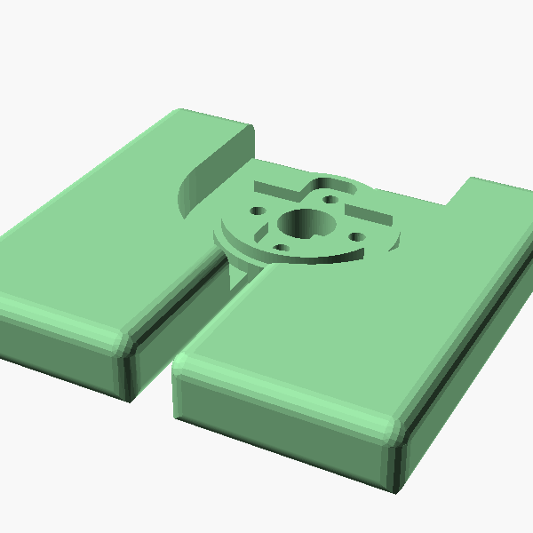 | 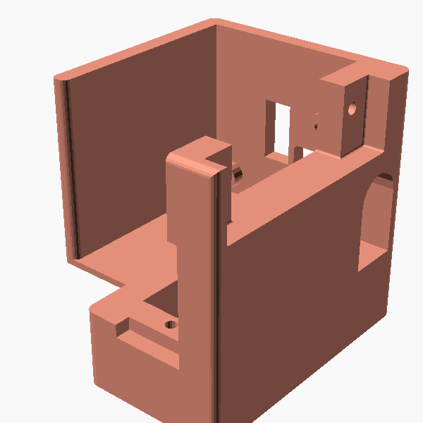 |
| Two pads + centre hub. The disc of holes is the **round-horn bolt pattern** (MG90S/SG90) — the pan horn screws here. The slot routes the servo cables down. | Chair-shaped. The **rectangular pocket** in the back wall takes the **tilt** servo body; the lower cradle holds the **pan** servo. |

| Head shell | Cat-ear hat |
|:---:|:---:|
| 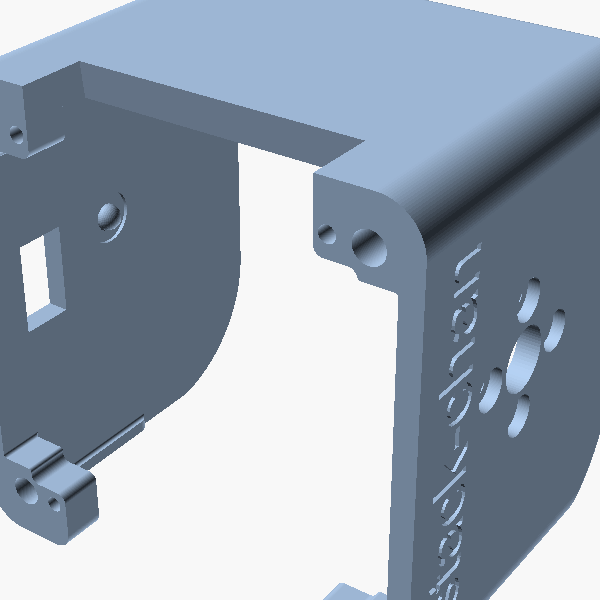 | 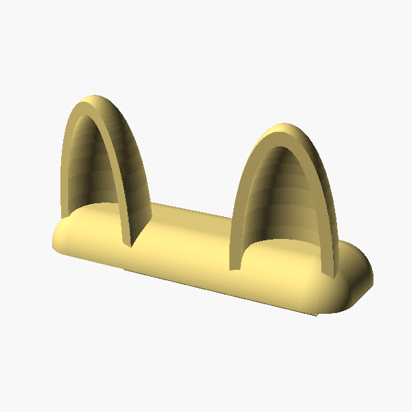 |
| Open front (display) and back; solid sides. One side carries the speaker grille + "stack-chan" logo. The inner side walls hold the **tilt pivot**. | Optional. Clips onto the top of the head. |

### Stand-ins (not printed — shown for clarity)

| MG90S servo (×2) | M5Stack CoreS3 |
|:---:|:---:|
| 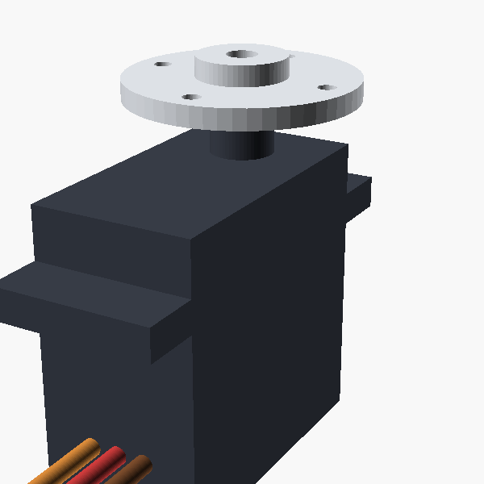 | 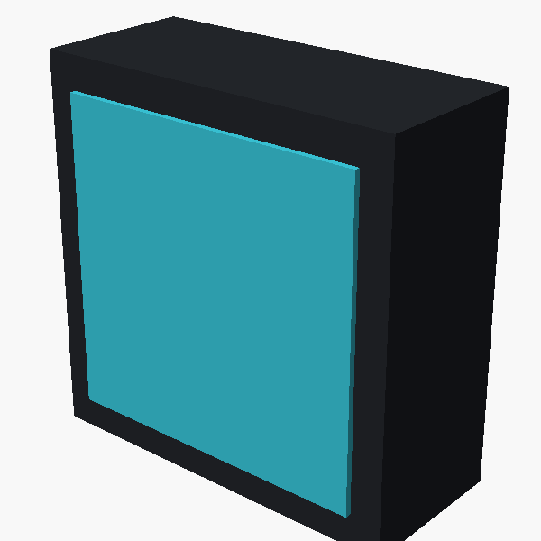 |
| Body + mounting flange, output shaft, **round horn**, and the 3-wire lead (signal/+5 V/GND). Same body class as SG90/MS18. | Display module that seats in the head, screen forward. |

---

## Exploded view

<p align="center">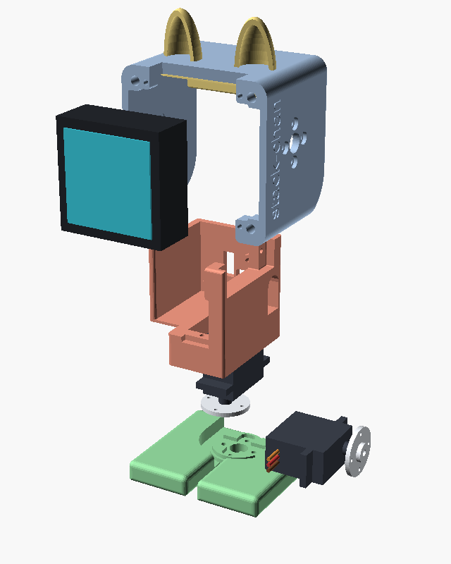</p>

Top → bottom along the build axis: **hat → head shell → CoreS3** (pulled to the
front) **→ bracket → tilt servo** (pulled to the side) **→ pan servo → feet**.

---

## Assembly sequence

### 1 · Centre both servos first
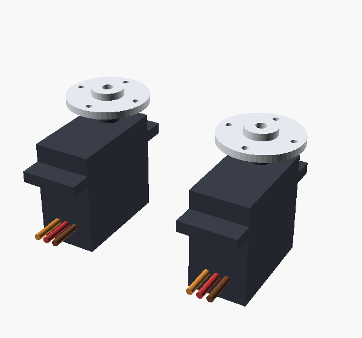

Power each servo and command it to its **mid position (90°)** *before* attaching
any horn, so the mechanism's travel ends up centred. Do this for both the pan and
the tilt servo.

<br clear="all">

### 2 · Pan servo → feet
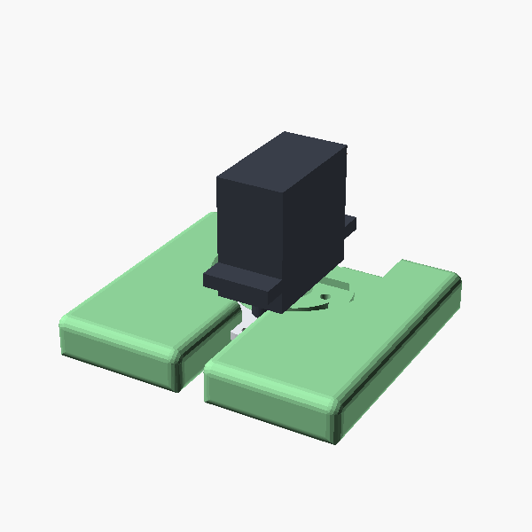

Screw the **round horn** to the **feet centre hub**. Seat the pan servo body so
its output shaft engages that horn, pointing **down** into the hub. Because the
horn is fixed to the (stationary) feet, the servo body — and everything above it —
will **rotate on the feet**. This is the **yaw** axis → **PCA9685 ch0**.

<br clear="all">

### 3 · Tilt servo → bracket
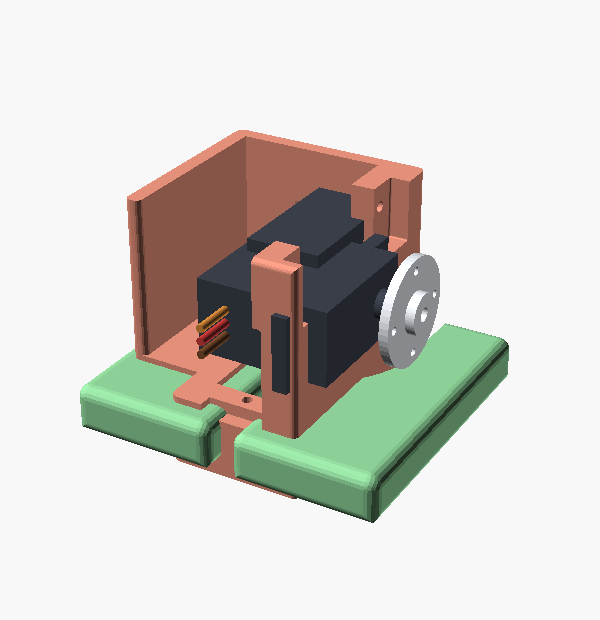

Drop the **bracket** over the pan servo (its lower cradle captures the pan servo
body). Seat the second servo in the bracket's **upper pocket** with its shaft
**horizontal**, on the head-tilt axis. This is the **pitch** axis → **ch1**.
Route both servo leads down through the bracket and the feet's centre slot.

<br clear="all">

### 4 · Head shell on
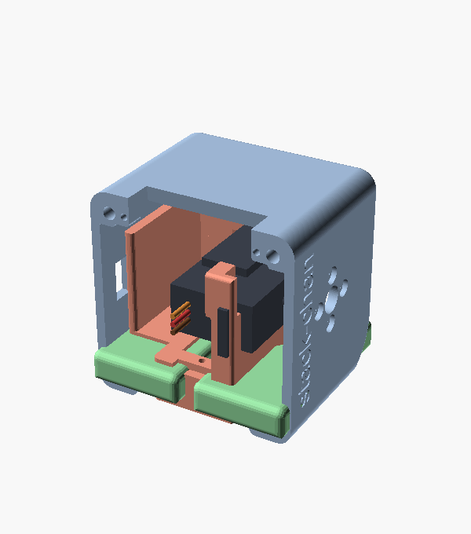

Lower the **shell** onto the tilt servo: the head's side-wall pivots line up with
the tilt servo shaft (one side) and a free pivot screw (the other). The head now
**nods** on the bracket. Keep the open face pointing **front (−Y)**.

<br clear="all">

### 5 · Seat the CoreS3
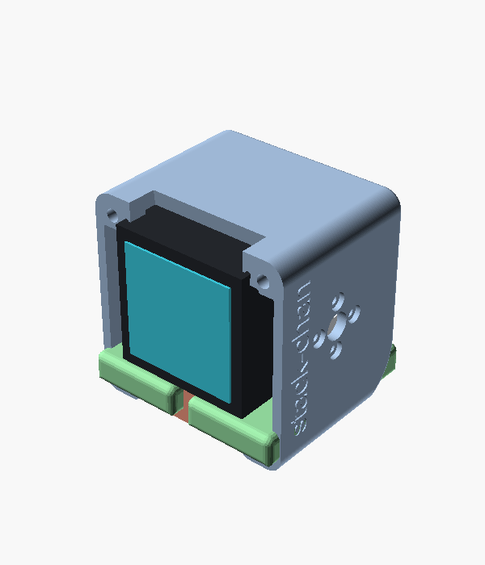

Slide the **CoreS3** into the head with the **display facing forward**. Its USB-C
and buttons stay accessible at the edges; the servo leads exit below toward the
PCA9685.

<br clear="all">

### 6 · Hat (optional)
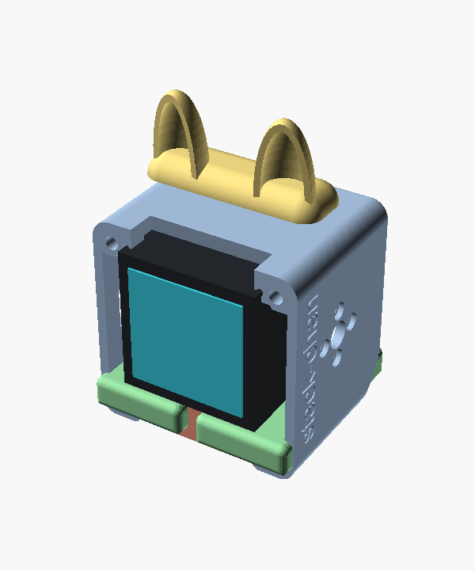

Clip the **cat-ear hat** onto the top of the head. Done — stack-chan is assembled.

<br clear="all">

---

## Wiring & power

- **Pan** servo → **PCA9685 ch0**   ·   **Tilt** servo → **PCA9685 ch1**
  (matches `src/hal/Servos.cpp`: `writeYaw_`→ch0, `writePitch_`→ch1).
- Power the servos from a **dedicated 5 V** rail (barrel jack → PCA9685 **V+**),
  sharing a **common ground** with the CoreS3. **Do not** run servo power off the
  CoreS3 rail.
- PCA9685 I²C + power to the CoreS3 (Port A Grove `Wire`, or M-Bus `Wire1`
  G43/G44 per `Servos.cpp`).
- Optional electronics base: drop the feet into the pedestal's top recess; the
  PCA9685 + barrel jack live inside. See [`pedestal-sg90.scad`](pedestal-sg90.scad).

## Movement & care

- Stay within the firmware limits (**yaw ±45°, pitch ±25°**) — gentle desk motion.
- Never **back-drive a powered servo** by hand.

---

## Regenerating these images

The renders come from one OpenSCAD scene, driven headless (no display needed):

```sh
# needs: openscad, and the upstream Takao STL set (see Sources)
STL_DIR=~/cloned/stackchan-sg90-models/stackchan_sg90_case_takao_version \
  hardware/enclosure/tools/render-assembly.sh
```

- Scene: [`scene/assembly.scad`](scene/assembly.scad) — STL imports + servo/CoreS3
  stand-ins, posed per stage (`-D 'stage="exploded"'`, `step1`…`step6`, etc.).
- Renderer: [`tools/render-assembly.sh`](tools/render-assembly.sh) — writes every
  PNG in [`images/`](images/) (~2 s for the whole set).

## Sources & attribution

- SG90 Takao STLs (head shell, bracket, feet, hat): **Takao Akaki**, via
  [`mongonta0716/3DPrinter_Models`](https://github.com/mongonta0716/3DPrinter_Models)
  (`stackchan_sg90_case_takao_version`). Not redistributed in this repo — clone
  upstream and point `STL_DIR` at it.
- Stack-chan project: <https://github.com/meganetaaan/stack-chan>
